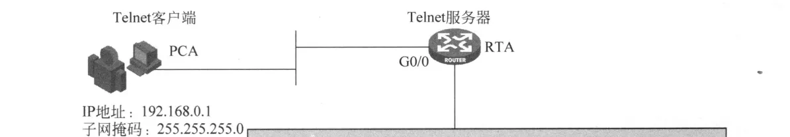

# 华为实验

## **配置远程登录**

通过Telnet登录路由器

1.拓扑图



2.实验要求

PCA 与路由器 RTA 直接通过以太网相连,用户级别要求位置为15级。按图示命令配置好路由器 RTA,并对 PCA 配置 IP地址和子网掩码,启动 Telnet 客户端,即可登录 RTA 的命令行、

- 实验配置
    
    ```hcl
    
    **在Telnet服务器R1上**
    ##配置 IP地址,以便提供IP 连通性
    [R1]int GigabitEthernet 0/0/0  //进入0/0/0端口
    [R1-GigabitEthernet0/0/0]ip address 192.168.1.1 24   //配置IP地址
    [R1]telnet server enable    //启动Telnet服务
     Error: TELNET server has been enabled   
    [R1]user-interface vty 0 4   //进入VTY用户视图
    [R1-ui-vty0-4]protocol inbound telnet   //指定VTY用户界面所支持的协议为Telnet
    [R1-ui-vty0-4]authentication-mode password   //配置认证方式为password
    [R1-ui-vty0-4]set authentication password cipher 123456   //配置登录密码为123456
    [R1-ui-vty0-4]user privilege level 15   //配置VTY用户界面的级别为15
    ######################################################################
    **在Telnet client上**
    [Huawei]int GigabitEthernet 0/0/0    //进入0/0/0端口
    [Huawei-GigabitEthernet0/0/0]ip ad 192.168.1.2 24   //配置IP地址
    <Huawei>telnet 192.168.1.1    //远程登录1.1
      Press CTRL_] to quit telnet mode
      Trying 192.168.1.1 ...
      Connected to 192.168.1.1 ...
    
    Login authentication
    
    Password:                        //server上设置的密码123456
    hello! welcome to huawei!
    <R1>                              //成功登录
    <R1>
    
    ------------------------------------------------------------------------
    **在Telnet server上**
    [R1]int GigabitEthernet 0/0/0       //进入0/0/0端口
    [R1-GigabitEthernet0/0/0]ip ad 192.168.1.1 24
    [R1]telnet server enable   //启动Telnet服务
    [R1]aaa    //进入aaa视图
    [R1-aaa]local-user huawei password cipher 123456    //创建本地用户huawei，密码为123456
    Info: Add a new user.
    [R1-aaa]local-user huawei  service-type telnet   //配置本地用户huawei的接入类型为Telnet
    [R1-aaa]local-user huawei privilege level 15    //配置本地用户huawei的级别为15
    [R1]user-interface vty  0 4    //进入VTY用户视图
    [R1-ui-vty0-4]authentication-mode aaa     //配置认证方式为aaa
    [R1-ui-vty0-4]protocol inbound telnet     //指定VTY用户界面所支持的协议为Telnet
    ##################################################################
    在Telnet client上
    [Huawei]int GigabitEthernet 0/0/0    //进入0/0/0端口
    [Huawei-GigabitEthernet0/0/0]ip ad 192.168.1.2 24   //配置IP地址
    <Huawei>telnet 192.168.1.1
      Press CTRL_] to quit telnet mode
      Trying 192.168.1.1 ...
      Connected to 192.168.1.1 ...
    
    Login authentication
    
    Username:huawei         //用户名
    Password:              //密码123456。不显示
    
    hello! welcome to h3c!
    <R1>
    <R1>                     //成功登录
    <R1>
    ```
    

[support.huawei.com](https://support.huawei.com/enterprise/zh/doc/EDOC1100277061/b3180b88)

## 配置ssh登录

## 配置FTP传输文件

配置参考

[support.huawei.com](https://support.huawei.com/enterprise/zh/doc/EDOC1100212504/50b2a01)

实验需求

远端服务器提供FTP Server功能，IP地址为192.168.1.1/24。设备作为FTP客户端，IP地址为192.168.1.2/24，与服务器之间的路由可达。设备需要进行升级操作，要求从FTP服务器上下载系统软件至设备

实验拓扑


- 实验配置
    
    ```hcl
    在FTP Server上
    <Huawei> dir      //查看文件信息
    Directory of flash:/
    
      Idx  Attr     Size(Byte)  Date        Time(LMT)  FileName 
        0  drw-              -  Jun 30 2025 11:21:46   dhcp
        1  -rw-        121,802  May 26 2014 09:20:58   portalpage.zip
        2  drw-              -  Jun 30 2025 12:07:14   **ftp**
        3  -rw-          2,263  Jun 30 2025 12:17:19   statemach.efs
        4  -rw-        828,482  Jun 30 2025 11:58:57   sslvpn.zip
    <Huawei>cd ftp/      //进入目录
    <Huawei>dir          //查看目录下文件
    Directory of flash:/ftp/
    
      Idx  Attr     Size(Byte)  Date        Time(LMT)  FileName 
        0  drw-              -  Jun 30 2025 12:01:08   1.zip
        1  -rw-        121,802  Jun 30 2025 12:07:16   portalpage.zip
        2  drw-              -  Jun 30 2025 12:01:13   2.zip
        3  -rw-        828,482  Jun 30 2025 12:06:16   sslvpn.zip
    
    1,090,732 KB total (783,520 KB free)
    <Huawei>rename sslvpn.zip  **ftp113.zip**    //更改文件名
    Rename flash:/ftp/sslvpn.zip to flash:/ftp/ftp113.zip? (y/n)[n]:y
    Info: Rename file flash:/ftp/sslvpn.zip to flash:/ftp/ftp113.zip ......Done
    <Huawei>dir      //查看文件
    Directory of flash:/ftp/
    
      Idx  Attr     Size(Byte)  Date        Time(LMT)  FileName 
        0  drw-              -  Jun 30 2025 12:01:08   1.zip
        1  -rw-        121,802  Jun 30 2025 12:07:16   portalpage.zip
        2  -rw-        828,482  Jun 30 2025 12:06:16   **ftp113.zip**
        3  drw-              -  Jun 30 2025 12:01:13   2.zip
    
    1,090,732 KB total (783,520 KB free)
    [Huawei]int GigabitEthernet 0/0/0     //进入0/0/0端口
    [Huawei-GigabitEthernet0/0/0]ip address 192.168.1.1 24    //配置IP地址
    [Huawei]ftp server enable      //开启FTP服务
    Info: Succeeded in starting the FTP server
    [Huawei]aaa            //进入aaa视图
    [Huawei-aaa]local-user admin password cipher 123456     //设置用户名为admin，密码为123456用户
    [Huawei-aaa]local-user admin privilege level 15    //设置用户权限等级为15
    [Huawei-aaa]local-user admin service-type ftp      //配置用户admin的接入类型为FTP
    [Huawei-aaa]local-user admin ftp-directory flash:/    //配置用户admin的FTP目录
    ##**client上传完成后在查看**##
    <Huawei>dir     //查看文件
    Directory of flash:/
    
      Idx  Attr     Size(Byte)  Date        Time(LMT)  FileName 
        0  drw-              -  Jun 30 2025 11:21:46   dhcp
        1  -rw-        121,802  May 26 2014 09:20:58   portalpage.zip
        2  drw-              -  Jun 30 2025 12:22:08   ftp
        3  -rw-        121,802  Jun 30 2025 12:49:05   **put223.zip**
        4  -rw-          2,263  Jun 30 2025 12:17:19   statemach.efs
        5  -rw-        828,482  Jun 30 2025 11:58:57   sslvpn.zip
    
    1,090,732 KB total (783,400 KB free)
    ####################################################################
    在FTP Client上
    <client>dir    //查看文件，并没有put223.zip、ftp113.zip
    Directory of flash:/
    
      Idx  Attr     Size(Byte)  Date        Time(LMT)  FileName 
        0  drw-              -  Jun 30 2025 08:26:38   dhcp
        1  -rw-        121,802  Jun 30 2025 11:58:14   portalpage.zip
        2  -rw-          2,263  Jun 30 2025 12:17:21   statemach.efs
        3  -rw-        828,482  Jun 30 2025 12:11:47   sslvpn.zip
    
    1,090,732 KB total (784,464 KB free)
    <client>mkdir put   //创建目录名称为PUT，为上传到server上做准备
    Info: Create directory flash:/put......Done
    <client>cd put    //进入目录
    <client>dir     //查看文件
    Info: File can't be found in the directory
    1,090,732 KB total (784,460 KB free)
    <client>cd flash:
    <client>dir
    Directory of flash:/
    
      Idx  Attr     Size(Byte)  Date        Time(LMT)  FileName 
        0  drw-              -  Jun 30 2025 08:26:38   dhcp
        1  -rw-        121,802  Jun 30 2025 11:58:14   portalpage.zip
        2  drw-              -  Jun 30 2025 12:25:55   **put**
        3  -rw-          2,263  Jun 30 2025 12:17:21   statemach.efs
        4  -rw-        828,482  Jun 30 2025 12:11:47   sslvpn.zip
    
    1,090,732 KB total (784,460 KB free)
    <client>copy portalpage.zip put/   //复制文件portalpage.zip到PUT下
    Copy flash:/portalpage.zip to flash:/put/portalpage.zip? (y/n)[n]:y
    
      1%  complete
      2%  complete
      3%  complete
      5%  complete
      6%  complete
          .
          .
          .
     98%  complete
     99%  complete
    100%  complete
    Info: Copied file flash:/portalpage.zip to flash:/put/portalpage.zip...Done
    <client>cd put/ //进入PUT目录
    <client>dir     //查看文件
    Directory of flash:/put/
    
      Idx  Attr     Size(Byte)  Date        Time(LMT)  FileName 
        0  -rw-        121,802  Jun 30 2025 12:26:45   **portalpage.zip**
    
    1,090,732 KB total (784,336 KB free)
    <client>**rename** portalpage.zip put223.zip    //将portalpage.zip更改为put223.zip
    Rename flash:/put/portalpage.zip to flash:/put/put223.zip? (y/n)[n]:y
    Info: Rename file flash:/put/portalpage.zip to flash:/put/put223.zip ......Done
    <client>dir    //查看文件
    Directory of flash:/put/
    
      Idx  Attr     Size(Byte)  Date        Time(LMT)  FileName 
        0  -rw-        121,802  Jun 30 2025 12:26:45   **put223.zip**
    
    1,090,732 KB total (784,340 KB free)
    <client>ftp 192.168.1.1    //FTP登录到1.1
    Trying 192.168.1.1 ...
    
    Press CTRL+K to abort
    Connected to 192.168.1.1.
    220 FTP service ready.
    User(192.168.1.1:(none)):admin   //用户名称
    331 Password required for admin.
    Enter password:       //密码123456
    230 User logged in.
    [client-ftp]dir    //查看文件
    200 Port command okay.
    150 Opening ASCII mode data connection for *.
    drwxrwxrwx   1 noone    nogroup         0 Jun 30 11:21 dhcp
    -rwxrwxrwx   1 noone    nogroup    121802 May 26  2014 portalpage.zip
    drwxrwxrwx   1 noone    nogroup         0 Jun 30 12:22 ftp
    -rwxrwxrwx   1 noone    nogroup      2263 Jun 30 12:17 statemach.efs
    -rwxrwxrwx   1 noone    nogroup    828482 Jun 30 11:58 sslvpn.zip
    drwxrwxrwx   1 noone    nogroup         0 Jun 30 12:17 .
    226 Transfer complete.
    FTP: 387 byte(s) received in 0.160 second(s) 2.41Kbyte(s)/sec.
    [client-ftp]cd ftp    //切换目录
    250 CWD command successful.
    
    [client-ftp]dir     //查看文件
    200 Port command okay.
    150 Opening ASCII mode data connection for *.
    drwxrwxrwx   1 noone    nogroup         0 Jun 30 12:01 1.zip
    drwxrwxrwx   1 noone    nogroup         0 Jun 30 12:17 ..
    -rwxrwxrwx   1 noone    nogroup    121802 Jun 30 12:07 portalpage.zip
    -rwxrwxrwx   1 noone    nogroup    828482 Jun 30 12:06 **ftp113.zip**
    drwxrwxrwx   1 noone    nogroup         0 Jun 30 12:01 2.zip
    drwxrwxrwx   1 noone    nogroup         0 Jun 30 12:22 .
    226 Transfer complete.
    FTP: 379 byte(s) received in 0.110 second(s) 3.44Kbyte(s)/sec.
    [client-ftp]**get** ftp113.zip     //下载文件ftp113.zip
    200 Port command okay.
    150 Opening ASCII mode data connection for ftp113.zip.
     1% 2% 3% 4% 5% 6% 7% 8% 9%10%11%12%13%14%15%16%17%18%19%20%
    21%22%23%24%25%26%27%28%29%30%31%32%33%34%35%36%37%38%39%40%
    41%42%43%44%45%46%47%48%49%50%51%52%53%54%55%56%57%58%59%60%
    61%62%63%64%65%66%67%68%69%70%71%72%73%74%75%76%77%78%79%80%
    81%82%83%84%85%86%87%88%89%90%91%92%93%94%95%96%97%98%99%226 
    Transfer complete.
    FTP: 828482 byte(s) received in 2.970 second(s) 278.95Kbyte(s)/sec.
    [client-ftp]**put** put223.zip    //上传文件put223.zip 
    200 Port command okay.
    150 Opening ASCII mode data connection for put223.zip.
    13%26%40%53%67%80%94%
     100%     
    226 Transfer complete.
    FTP: 121802 byte(s) sent in 0.520 second(s) 234.23Kbyte(s)/sec.
    <client>dir     //查看文件
    Directory of flash:/
    
      Idx  Attr     Size(Byte)  Date        Time(LMT)  FileName 
        0  drw-              -  Jun 30 2025 08:26:38   dhcp
        1  -rw-        121,802  Jun 30 2025 11:58:14   portalpage.zip
        2  -rw-        828,482  Jun 30 2025 12:41:30   **ftp113.zip**
        3  drw-              -  Jun 30 2025 12:27:12   put
        4  -rw-          2,263  Jun 30 2025 12:17:21   statemach.efs
        5  -rw-        828,482  Jun 30 2025 12:11:47   sslvpn.zip
    
    1,090,732 KB total (783,528 KB free)
    ```
    

## TFTP实验

[support.huawei.com](https://support.huawei.com/enterprise/zh/doc/EDOC1000069491/ae1b7ce1)

## PPP配置

[support.huawei.com](https://support.huawei.com/enterprise/zh/doc/EDOC1100112418/498bdea9)

- PAP单向验证
    
    
    
    
    ```hcl
    ##**PAP单向验证**##
    ##在主验证方上##
    [R1]int Serial 2/0/0	  //进入端口
    [R1-Serial2/0/0]ip address 10.0.12.1 30   //配置IP地址
    [R1-Serial2/0/0]link-protocol ppp   //设置链路模式
    [R1]aaa     //进入aaa视图
    [R1-aaa]authentication-scheme system_a     //创建认证方案system_a
    Info: Create a new authentication scheme.
    [R1-aaa-authen-system_a]authentication-mode local   //使用本地认证模式
    [R1-aaa]domain system   //进入用户域，system是默认的用户域
    Info: Success to create a new domain.
    [R1-aaa-domain-system]authentication-scheme system_a     //指定认证方案为system_a
    [R1-aaa]local-user pppuser password cipher 123456      //创建用户名为pppuser，密码123456的用户
    Info: Add a new user.
    [R1-aaa]local-user pppuser service-type ppp   //指定用户pppuser的使用类型为ppp
    [R1]int Serial 2/0/0
    [R1-Serial2/0/0]ppp authentication-mode pap domain system   //ppp的认证方式为pap并且使用system域中认证方案认证
    [R1-Serial2/0/0]shutdown    //关闭端口 
    [R1-Serial2/0/0]un shutdown    ///开启端口（让配置生效）
    [R1-Serial2/0/0]dis ip in b    //查看接口ip状态
    *down: administratively down
    ^down: standby
    (l): loopback
    (s): spoofing
    The number of interface that is UP in Physical is 2
    The number of interface that is DOWN in Physical is 3
    The number of interface that is UP in Protocol is 2
    The number of interface that is DOWN in Protocol is 3
    
    Interface                         IP Address/Mask      Physical   Protocol  
    GigabitEthernet0/0/0              unassigned           down       down      
    GigabitEthernet0/0/1              unassigned           down       down      
    NULL0                             unassigned           up         up(s)     
    **Serial2/0/0                       10.0.12.1/30         up         up**        
    Serial2/0/1                       unassigned           down       down      
    [R1-Serial2/0/0]ping 10.0.12.2         //测试连通性
      PING 10.0.12.2: 56  data bytes, press CTRL_C to break
        Reply from 10.0.12.2: bytes=56 Sequence=1 ttl=255 time=40 ms
        Reply from 10.0.12.2: bytes=56 Sequence=2 ttl=255 time=30 ms
        Reply from 10.0.12.2: bytes=56 Sequence=3 ttl=255 time=30 ms
        Reply from 10.0.12.2: bytes=56 Sequence=4 ttl=255 time=30 ms
        Reply from 10.0.12.2: bytes=56 Sequence=5 ttl=255 time=20 ms
    
      --- 10.0.12.2 ping statistics ---
        5 packet(s) transmitted
        5 packet(s) received
        0.00% packet loss
        round-trip min/avg/max = 20/30/40 ms
    
    [R1-Serial2/0/0]dis int s2/0/0      //查看接口信息
    Serial2/0/0 current state : **UP**      //物理层UP
    Line protocol current state : **UP**    //链路层UP
    Last line protocol up time : 2025-07-04 15:55:28 UTC-08:00
    Description:HUAWEI, AR Series, Serial2/0/0 Interface
    Route Port,The Maximum Transmit Unit is 1500, Hold timer is 10(sec)
    Internet Address is 10.0.12.1/30
    Link layer protocol is PPP
    LCP **opened**, IPCP **opened**           //说明链路协商成功
    Last physical up time   : 2025-07-04 15:55:25 UTC-08:00
    Last physical down time : 2025-07-04 15:53:51 UTC-08:00
    Current system time: 2025-07-04 15:56:21-08:00
    Physical layer is synchronous, Virtualbaudrate is 64000 bps
    Interface is DTE, Cable type is V11, Clock mode is TC
    Last 300 seconds input rate 6 bytes/sec 48 bits/sec 0 packets/sec
    Last 300 seconds output rate 3 bytes/sec 24 bits/sec 0 packets/sec
    
    Input: 98 packets, 3935 bytes
      Broadcast:              0,  Multicast:              0
      Errors:                 0,  Runts:                  0
      Giants:                 0,  CRC:                    0
    
      Alignments:             0,  Overruns:               0
      Dribbles:               0,  Aborts:                 0
      No Buffers:             0,  Frame Error:            0
    
    Output: 100 packets, 2052 bytes
      Total Error:            0,  Overruns:               0
      Collisions:             0,  Deferred:               0
        Input bandwidth utilization  :    0%
        Output bandwidth utilization :    0%
    #########################################################################
    ##被验证方R2上##
    [R2]interface  Serial 2/0/0       //进入接口
    [R2-Serial2/0/0]ip ad 10.0.12.2 30    //配置IP地址
    [R2-Serial2/0/0]link-protocol ppp    //设置链路模式
    [R2-Serial2/0/0]ppp pap local-user pppuser password cipher 123456   //使用pap的pppuser（R1上配置的）用户名进行认证，密码为123456
    [R2-Serial2/0/0]shutdown      //关闭接口
    [R2-Serial2/0/0]un shutdown    //启用接口（确保配置更新）
    <R2>display interface Serial2/0/0 
    Serial2/0/0 current state : **UP**          //物理层UP
    Line protocol current state : **UP**        //链路层UP
    Last line protocol up time : 2025-07-04 15:55:28 UTC-08:00
    Description:HUAWEI, AR Series, Serial2/0/0 Interface
    Route Port,The Maximum Transmit Unit is 1500, Hold timer is 10(sec)
    Internet Address is 10.0.12.2/30
    Link layer protocol is PPP
    **LCP opened, IPCP opened**     //说明协商成功
    Last physical up time   : 2025-07-04 15:55:25 UTC-08:00
    Last physical down time : 2025-07-04 15:53:58 UTC-08:00
    Current system time: 2025-07-04 16:06:00-08:00
    Physical layer is synchronous, Virtualbaudrate is 64000 bps
    Interface is DTE, Cable type is V11, Clock mode is TC
    Last 300 seconds input rate 6 bytes/sec 48 bits/sec 0 packets/sec
    Last 300 seconds output rate 2 bytes/sec 16 bits/sec 0 packets/sec
    
    Input: 216 packets, 7764 bytes
      Broadcast:              0,  Multicast:              0
      Errors:                 0,  Runts:                  0
      Giants:                 0,  CRC:                    0
    
      Alignments:             0,  Overruns:               0
      Dribbles:               0,  Aborts:                 0
      No Buffers:             0,  Frame Error:            0
    
    Output: 216 packets, 3403 bytes
      Total Error:            0,  Overruns:               0
      Collisions:             0,  Deferred:               0
        Input bandwidth utilization  :    0%
        Output bandwidth utilization :    0%
    
    ```
    
- PAP双向验证
    
    
    
    
    ```hcl
    [R1]aaa
    [R1-aaa]authentication-scheme system_1
    Info: Create a new authentication scheme.
    [R1-aaa-authen-system_1]authentication-mode local 
    [R1-aaa]domain system
    Info: Success to create a new domain.
    [R1-aaa-domain-system]authorization-scheme system_1
    Error: The authorization scheme does not exist.
    [R1-aaa]local-user user1 password cipher 123456
    Info: Add a new user.
    [R1-aaa]local-user user1 service-type ppp 
    [R1]int Serial 2/0/0	
    [R1-Serial2/0/0]ppp authentication-mode pap domain system
    [R1-Serial2/0/0]shutdown
    [R1-Serial2/0/0]ppp pap local-user user2 password cipher 456789
    [R1-Serial2/0/0]un shutdown 
    <R1>display  interface Serial2/0/0
    Serial2/0/0 current state : **UP**
    Line protocol current state : **UP**
    Last line protocol up time : 2025-07-04 16:23:36 UTC-08:00
    Description:HUAWEI, AR Series, Serial2/0/0 Interface
    Route Port,The Maximum Transmit Unit is 1500, Hold timer is 10(sec)
    Internet Address is 10.0.12.1/30
    Link layer protocol is PPP
    LCP **opened**, IPCP **opened**
    Last physical up time   : 2025-07-04 16:23:33 UTC-08:00
    Last physical down time : 2025-07-04 16:23:32 UTC-08:00
    Current system time: 2025-07-04 16:28:43-08:00
    Physical layer is synchronous, Virtualbaudrate is 64000 bps
    Interface is DTE, Cable type is V11, Clock mode is TC
    Last 300 seconds input rate 6 bytes/sec 48 bits/sec 0 packets/sec
    Last 300 seconds output rate 2 bytes/sec 16 bits/sec 0 packets/sec
    
    Input: 143 packets, 5134 bytes
      Broadcast:              0,  Multicast:              0
      Errors:                 0,  Runts:                  0
      Giants:                 0,  CRC:                    0
    
      Alignments:             0,  Overruns:               0
      Dribbles:               0,  Aborts:                 0
      No Buffers:             0,  Frame Error:            0
    
    Output: 144 packets, 2316 bytes
      Total Error:            0,  Overruns:               0
      Collisions:             0,  Deferred:               0
        Input bandwidth utilization  :    0%
        Output bandwidth utilization :    0%
    
    [R2]aaa
    [R2-aaa]authorization-scheme system_2
    Info: Create a new authorization scheme.
    [R2-aaa-author-system_2]authorization-mode local 
    [R2-aaa]domain system
    Info: Success to create a new domain.
    [R2-aaa-domain-system]authentication-scheme system_2
    Error: The authentication scheme does not exist.
    [R2-aaa]local-user user2 password cipher 456789
    Info: Add a new user.
    [R2-aaa]local-user user2 service-type ppp 
    [R2]interface Serial 2/0/0
    [R2-Serial2/0/0]link-protocol ppp 
    [R2-Serial2/0/0]ppp authentication-mode pap domain system
    [R2-Serial2/0/0]ppp pap local-user user1 password cipher 123456
    [R2-Serial2/0/0]shutdown 
    [R2-Serial2/0/0]un shutdown 
    [R2-Serial2/0/0]display interface Serial2/0/0
    Serial2/0/0 current state : UP
    Line protocol current state : UP
    Last line protocol up time : 2025-07-04 16:23:35 UTC-08:00
    Description:HUAWEI, AR Series, Serial2/0/0 Interface
    Route Port,The Maximum Transmit Unit is 1500, Hold timer is 10(sec)
    Internet Address is 10.0.12.2/30
    Link layer protocol is PPP
    LCP opened, IPCP opened
    Last physical up time   : 2025-07-04 16:23:32 UTC-08:00
    Last physical down time : 2025-07-04 16:23:25 UTC-08:00
    Current system time: 2025-07-04 16:28:10-08:00
    Physical layer is synchronous, Virtualbaudrate is 64000 bps
    Interface is DTE, Cable type is V11, Clock mode is TC
    Last 300 seconds input rate 7 bytes/sec 56 bits/sec 0 packets/sec
    Last 300 seconds output rate 2 bytes/sec 16 bits/sec 0 packets/sec
    
    Input: 137 packets, 4976 bytes
      Broadcast:              0,  Multicast:              0
      Errors:                 0,  Runts:                  0
      Giants:                 0,  CRC:                    0
    
      Alignments:             0,  Overruns:               0
      Dribbles:               0,  Aborts:                 0
      No Buffers:             0,  Frame Error:            0
    
    Output: 141 packets, 2278 bytes
      Total Error:            0,  Overruns:               0
      Collisions:             0,  Deferred:               0
        Input bandwidth utilization  :    0%
        Output bandwidth utilization :    0%
    [R2-Serial2/0/0]ping 10.0.12.1
      PING 10.0.12.1: 56  data bytes, press CTRL_C to break
        Reply from 10.0.12.1: bytes=56 Sequence=1 ttl=255 time=40 ms
        Reply from 10.0.12.1: bytes=56 Sequence=2 ttl=255 time=20 ms
        Reply from 10.0.12.1: bytes=56 Sequence=3 ttl=255 time=10 ms
        Reply from 10.0.12.1: bytes=56 Sequence=4 ttl=255 time=20 ms
        Reply from 10.0.12.1: bytes=56 Sequence=5 ttl=255 time=20 ms
    
      --- 10.0.12.1 ping statistics ---
        5 packet(s) transmitted
        5 packet(s) received
        0.00% packet loss
        round-trip min/avg/max = 10/22/40 ms
    
    ```
    
- CHAP单向验证
    
    
    
    ```hcl
    [R1]aaa
    [R1-aaa]authorization-scheme system_1
    Info: Create a new authorization scheme.
    [R1-aaa-author-system_1]authorization-mode local 
    [R1-aaa]domain system
    Info: Success to create a new domain.
    [R1-aaa-domain-system]authorization-scheme system_1
    [R1-aaa]local-user user1 password cipher 123456
    Info: Add a new user.
    [R1-aaa]local-user user1 service-type ppp 
    [R1]int Serial 2/0/0
    [R1-Serial2/0/0]ppp authentication-mode chap domain system
    [R1-Serial2/0/0]shutdown 
    [R1-Serial2/0/0]un shutdown
    Jul  5 2025 00:12:12-08:00 R1 %%01PPP/4/PEERNOCHAP(l)[9]:On the interface Serial
    2/0/0, authentication failed and PPP link was closed because CHAP was disabled o
    n the peer. 
    Jul  5 2025 00:12:12-08:00 R1 %%01PPP/4/RESULTERR(l)[10]:On the interface Serial
    2/0/0, LCP negotiation failed because the result cannot be accepted. 
    Jul  5 2025 00:12:45-08:00 R1 %%01IFNET/4/LINK_STATE(l)[11]:The line protocol PP
    P on the interface Serial2/0/0 has entered the UP state. 
    <R1>display interface Serial2/0/0
    Serial2/0/0 current state : UP
    Line protocol current state : UP
    Last line protocol up time : 2025-07-05 00:12:45 UTC-08:00
    Description:HUAWEI, AR Series, Serial2/0/0 Interface
    Route Port,The Maximum Transmit Unit is 1500, Hold timer is 10(sec)
    Internet Address is 10.0.12.1/30
    Link layer protocol is PPP
    LCP opened, IPCP opened
    Last physical up time   : 2025-07-05 00:11:09 UTC-08:00
    Last physical down time : 2025-07-05 00:10:53 UTC-08:00
    Current system time: 2025-07-05 00:27:09-08:00
    Physical layer is synchronous, Virtualbaudrate is 64000 bps
    Interface is DTE, Cable type is V11, Clock mode is TC
    Last 300 seconds input rate 6 bytes/sec 48 bits/sec 0 packets/sec
    Last 300 seconds output rate 2 bytes/sec 16 bits/sec 0 packets/sec
    
    Input: 378 packets, 12982 bytes
      Broadcast:              0,  Multicast:              0
      Errors:                 0,  Runts:                  0
      Giants:                 0,  CRC:                    0
    
      Alignments:             0,  Overruns:               0
      Dribbles:               0,  Aborts:                 0
      No Buffers:             0,  Frame Error:            0
    
    Output: 378 packets, 5396 bytes
      Total Error:            0,  Overruns:               0
      Collisions:             0,  Deferred:               0
        Input bandwidth utilization  :    0%
        Output bandwidth utilization :    0%
    
    [R2]int Serial 2/0/0
    [R2-Serial2/0/0]ppp chap password cipher 123456
    [R2-Serial2/0/0]shutdown 
    [R2-Serial2/0/0]un shutdown 
    [R2-Serial2/0/0]ping 10.0.12.1
      PING 10.0.12.1: 56  data bytes, press CTRL_C to break
        Reply from 10.0.12.1: bytes=56 Sequence=1 ttl=255 time=30 ms
        Reply from 10.0.12.1: bytes=56 Sequence=2 ttl=255 time=20 ms
        Reply from 10.0.12.1: bytes=56 Sequence=3 ttl=255 time=20 ms
        Reply from 10.0.12.1: bytes=56 Sequence=4 ttl=255 time=20 ms
        Reply from 10.0.12.1: bytes=56 Sequence=5 ttl=255 time=20 ms
    
      --- 10.0.12.1 ping statistics ---
        5 packet(s) transmitted
        5 packet(s) received
        0.00% packet loss
        round-trip min/avg/max = 20/22/30 ms
    [R2-Serial2/0/0]display interface Serial2/0/0
    Serial2/0/0 current state : UP
    Line protocol current state : UP
    Last line protocol up time : 2025-07-05 00:12:45 UTC-08:00
    Description:HUAWEI, AR Series, Serial2/0/0 Interface
    Route Port,The Maximum Transmit Unit is 1500, Hold timer is 10(sec)
    Internet Address is 10.0.12.2/30
    Link layer protocol is PPP
    LCP opened, IPCP opened
    Last physical up time   : 2025-07-05 00:12:24 UTC-08:00
    Last physical down time : 2025-07-05 00:12:18 UTC-08:00
    Current system time: 2025-07-05 00:13:54-08:00
    Physical layer is synchronous, Virtualbaudrate is 64000 bps
    Interface is DTE, Cable type is V11, Clock mode is TC
    Last 300 seconds input rate 8 bytes/sec 64 bits/sec 0 packets/sec
    Last 300 seconds output rate 4 bytes/sec 32 bits/sec 0 packets/sec
    
    Input: 217 packets, 7793 bytes
      Broadcast:              0,  Multicast:              0
      Errors:                 0,  Runts:                  0
      Giants:                 0,  CRC:                    0
    
      Alignments:             0,  Overruns:               0
      Dribbles:               0,  Aborts:                 0
      No Buffers:             0,  Frame Error:            0
    
    Output: 218 packets, 3502 bytes
      Total Error:            0,  Overruns:               0
      Collisions:             0,  Deferred:               0
        Input bandwidth utilization  :    0%
        Output bandwidth utilization :    0%
    
    ```
    
- MP配置(无验证)
    
    
    
    ```hcl
    [R1]interface Virtual-Template 1
    Jul  5 2025 11:54:05-08:00 R1 %%01IFPDT/4/IF_STATE(l)[6]:Interface Virtual-Templ
    ate1 has turned into UP state.
    [R1-Virtual-Template1]ip address 10.0.12.1 30
    [R1]int Serial 2/0/0
    [R1-Serial2/0/0]ppp mp virtual-template 1
    [R1-Serial2/0/0]restart
    [R1-Serial2/0/0]int Serial 2/0/1
    [R1-Serial2/0/1]ppp mp  virtual-template 1
    [R1-Serial2/0/1]restart
    [R1]display ppp mp 
    
    Template is Virtual-Template1
     Bundle **49b836ddd671**, 2 members, slot 0, Master link is Virtual-Template1:0
      0 lost fragments, 0 reordered, 0 unassigned, 
     sequence 0/0 rcvd/sent
     The bundled sub channels are:
          Serial2/0/0
          Serial2/0/1
    [R1]dis ip in brief 
    *down: administratively down
    ^down: standby
    (l): loopback
    (s): spoofing
    The number of interface that is UP in Physical is 4
    The number of interface that is DOWN in Physical is 2
    The number of interface that is UP in Protocol is 4
    The number of interface that is DOWN in Protocol is 2
    
    Interface                         IP Address/Mask      Physical   Protocol  
    GigabitEthernet0/0/0              unassigned           down       down      
    GigabitEthernet0/0/1              unassigned           down       down      
    NULL0                             unassigned           up         up(s)     
    Serial2/0/0                       unassigned           up         up        
    Serial2/0/1                       unassigned           up         up        
    Virtual-Template1                 10.0.12.1/30         up         up        
    [R1]display  virtual-access
    Virtual-Template1:0 current state : UP
    Line protocol current state : UP 
    Last line protocol up time : 2025-07-05 11:56:59 UTC-08:00
    Description:HUAWEI, AR Series, Virtual-Template1:0 Interface
    Route Port,The Maximum Transmit Unit is 1500, Hold timer is 10(sec)
    Link layer protocol is PPP 
    LCP opened, MP opened, IPCP opened
    Physical is MP
    Current system time: 2025-07-05 11:58:20-08:00
        Last 300 seconds input rate 0 bits/sec, 0 packets/sec
        Last 300 seconds output rate 0 bits/sec, 0 packets/sec
        Realtime 0 seconds input rate 0 bits/sec, 0 packets/sec
        Realtime 0 seconds output rate 0 bits/sec, 0 packets/sec
        Input: 0 bytes
        Output:0 bytes
        Input bandwidth utilization  :    0%
        Output bandwidth utilization :    0%
    
    [R2]interface Virtual-Template 1
    [R2-Virtual-Template1]ip address 10.0.12.2 30
    [R2]interface Serial 2/0/0	
    [R2-Serial2/0/0]ppp mp virtual-template 1 
    [R2-Serial2/0/0]restart
    [R2-Serial2/0/0]interface Serial 2/0/1
    [R2-Serial2/0/1]ppp mp virtual-template 1
    [R2-Serial2/0/1]restart 
    [R2-Serial2/0/1]dis ppp m
    
    Template is Virtual-Template1
     Bundle **8cd2cf4feed5**, 2 members, slot 0, Master link is Virtual-Template1:0
      0 lost fragments, 0 reordered, 0 unassigned, 
     sequence 0/0 rcvd/sent
     The bundled sub channels are:
          Serial2/0/0
          Serial2/0/1
    [R2-Serial2/0/1]display virtual-access
    Virtual-Template1:0 current state : UP
    Line protocol current state : UP 
    Last line protocol up time : 2025-07-05 11:56:59 UTC-08:00
    Description:HUAWEI, AR Series, Virtual-Template1:0 Interface
    Route Port,The Maximum Transmit Unit is 1500, Hold timer is 10(sec)
    Link layer protocol is PPP 
    LCP opened, MP opened, IPCP opened
    Physical is MP
    Current system time: 2025-07-05 11:59:13-08:00
        Last 300 seconds input rate 0 bits/sec, 0 packets/sec
        Last 300 seconds output rate 0 bits/sec, 0 packets/sec
        Realtime 0 seconds input rate 0 bits/sec, 0 packets/sec
        Realtime 0 seconds output rate 0 bits/sec, 0 packets/sec
        Input: 0 bytes
        Output:0 bytes
        Input bandwidth utilization  :    0%
        Output bandwidth utilization :    0%
    [R2-Serial2/0/1]ping 10.0.12.1
      PING 10.0.12.1: 56  data bytes, press CTRL_C to break
        Reply from 10.0.12.1: bytes=56 Sequence=1 ttl=255 time=40 ms
        Reply from 10.0.12.1: bytes=56 Sequence=2 ttl=255 time=20 ms
        Reply from 10.0.12.1: bytes=56 Sequence=3 ttl=255 time=10 ms
        Reply from 10.0.12.1: bytes=56 Sequence=4 ttl=255 time=20 ms
        Reply from 10.0.12.1: bytes=56 Sequence=5 ttl=255 time=30 ms
    
      --- 10.0.12.1 ping statistics ---
        5 packet(s) transmitted
        5 packet(s) received
        0.00% packet loss
        round-trip min/avg/max = 10/24/40 ms
    
    ```
    
- MP配置（CHAP验证）
    
    
    
    ```hcl
    [R1]interface Virtual-Template 1
    [R1-Virtual-Template1]ip address 10.0.12.1 30
    [R1-Virtual-Template1]ppp mp binding-mode authentication 
    [R1]ppp mp user user2 bind virtual-template 1
    [R1]aaa
    [R1-aaa]local-user user1 password cipher 123
    Info: Add a new user.
    [R1-aaa]local-user user1 service-type ppp 
    [R1-aaa]authentication-scheme system_1
    Info: Create a new authentication scheme.
    [R1-aaa-authen-system_1]authentication-mode local 
    [R1-aaa]domain system
    Info: Success to create a new domain.
    [R1-aaa-domain-system]authorization-scheme system_1
    Error: The authorization scheme does not exist.
    [R1]interface Serial 2/0/0
    [R1-Serial2/0/0]ppp authentication-mode chap domain system
    [R1-Serial2/0/0]ppp chap user user2 
    [R1-Serial2/0/0]ppp chap password cipher 456
    [R1-Serial2/0/0]ppp mp 
    [R1-Serial2/0/0]interface Serial 2/0/1
    [R1-Serial2/0/1]ppp chap user user2
    [R1-Serial2/0/1]ppp authentication-mode chap domain system
    [R1-Serial2/0/1]ppp chap user user2
    [R1-Serial2/0/1]ppp chap password cipher 456
    [R1-Serial2/0/1]ppp mp 
    [R1]interface Serial 2/0/0
    [R1-Serial2/0/0]shutdown 
    [R1-Serial2/0/0]un shutdown 
    [R1-Serial2/0/0]interface Serial 2/0/1
    [R1-Serial2/0/1]shutdown 
    [R1-Serial2/0/1]un shutdown 
    [R1-Serial2/0/1]dis ppp mp
    
    Template is Virtual-Template1
     Bundle user1, 2 members, slot 0, Master link is Virtual-Template1:0
      0 lost fragments, 0 reordered, 0 unassigned, 
     sequence 0/0 rcvd/sent
     The bundled sub channels are:
          Serial2/0/0
          Serial2/0/1
    [R1-Serial2/0/1]display  virtual-access 
    Virtual-Template1:0 current state : UP
    Line protocol current state : UP 
    Last line protocol up time : 2025-07-05 14:56:30 UTC-08:00
    Description:HUAWEI, AR Series, Virtual-Template1:0 Interface
    Route Port,The Maximum Transmit Unit is 1500, Hold timer is 10(sec)
    Link layer protocol is PPP 
    LCP opened, MP opened, IPCP opened
    Physical is MP
    Current system time: 2025-07-05 14:58:54-08:00
        Last 300 seconds input rate 0 bits/sec, 0 packets/sec
        Last 300 seconds output rate 0 bits/sec, 0 packets/sec
        Realtime 0 seconds input rate 0 bits/sec, 0 packets/sec
        Realtime 0 seconds output rate 0 bits/sec, 0 packets/sec
        Input: 0 bytes
        Output:0 bytes
        Input bandwidth utilization  :    0%
        Output bandwidth utilization :    0%
    
    [R1-Serial2/0/1]ping 10.0.12.2
      PING 10.0.12.2: 56  data bytes, press CTRL_C to break
        Reply from 10.0.12.2: bytes=56 Sequence=1 ttl=255 time=50 ms
        Reply from 10.0.12.2: bytes=56 Sequence=2 ttl=255 time=40 ms
        Reply from 10.0.12.2: bytes=56 Sequence=3 ttl=255 time=20 ms
        Reply from 10.0.12.2: bytes=56 Sequence=4 ttl=255 time=20 ms
        Reply from 10.0.12.2: bytes=56 Sequence=5 ttl=255 time=20 ms
    
      --- 10.0.12.2 ping statistics ---
        5 packet(s) transmitted
        5 packet(s) received
        0.00% packet loss
        round-trip min/avg/max = 20/30/50 ms
    
    [R1-Serial2/0/1]shutdown 
    [R1-Serial2/0/1]ping 10.0.12.2
      PING 10.0.12.2: 56  data bytes, press CTRL_C to break
        Reply from 10.0.12.2: bytes=56 Sequence=1 ttl=255 time=20 ms
        Reply from 10.0.12.2: bytes=56 Sequence=2 ttl=255 time=20 ms
        Reply from 10.0.12.2: bytes=56 Sequence=3 ttl=255 time=10 ms
        Reply from 10.0.12.2: bytes=56 Sequence=4 ttl=255 time=20 ms
        Reply from 10.0.12.2: bytes=56 Sequence=5 ttl=255 time=20 ms
    
      --- 10.0.12.2 ping statistics ---
        5 packet(s) transmitted
        5 packet(s) received
        0.00% packet loss
        round-trip min/avg/max = 10/18/20 ms
    
    [R2]interface Virtual-Template 1
    [R2-Virtual-Template1]ip address 10.0.12.2 30
    [R2-Virtual-Template1]ppp mp binding-mode authentication 
    [R2]ppp mp user user2 bind virtual-template 1
    [R2]aaa
    [R2-aaa]local-user user2 password cipher 456
    Info: Add a new user.
    [R2-aaa]local-user user2 service-type ppp 
    [R2-aaa]authorization-scheme system_2
    Info: Create a new authorization scheme.
    [R2-aaa-author-system_2]authorization-mode local 
    [R2-aaa]domain system
    Info: Success to create a new domain.
    [R2-aaa-domain-system]authentication-scheme system_2
    Error: The authentication scheme does not exist.
    [R2]interface Serial 2/0/0
    [R2-Serial2/0/0]ppp authentication-mode chap domain system
    [R2-Serial2/0/0]ppp chap user user1
    [R2-Serial2/0/0]ppp chap password cipher 123	
    [R2-Serial2/0/0]ppp  mp 
    [R2-Serial2/0/0]interface Serial 2/0/1
    [R2-Serial2/0/1]ppp authentication-mode chap domain system
    [R2-Serial2/0/1]ppp chap user user1
    [R2-Serial2/0/1]ppp chap password cipher 123
    [R2-Serial2/0/1]ppp  mp 
    [R2-Serial2/0/1]shutdown 
    [R2-Serial2/0/1]undo shutdown 
    [R2-Serial2/0/1]interface Serial 2/0/0
    [R2-Serial2/0/0]shutdown  
    [R2-Serial2/0/0]un shutdown 
    
    ```